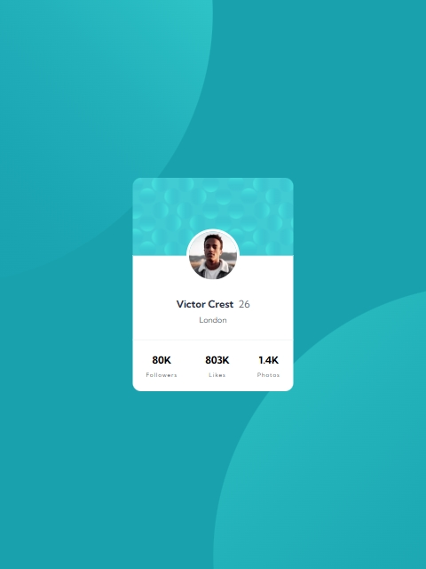

# Frontend Mentor - Profile card component solution

This is a solution to the [Profile card component challenge on Frontend Mentor](https://www.frontendmentor.io/challenges/profile-card-component-cfArpWshJ). Frontend Mentor challenges help you improve your coding skills by building realistic projects.

## Table of contents

- [Overview](#overview)
  - [The challenge](#the-challenge)
  - [Screenshot](#screenshot)
  - [Links](#links)
- [My process](#my-process)
  - [Built with](#built-with)
  - [What I learned](#what-i-learned)
  - [Continued development](#continued-development)
- [Author](#author)

## Overview

### The challenge

- Build out the project to the designs provided

### Screenshot

### Links

- Solution URL: [Solution](https://github.com/socratesioa/profile-card-component)
- Live Site URL: [Live Site](https://socratesioa.github.io/profile-card-component)

## My process

### Built with

- Semantic HTML5 markup
- CSS custom properties
- Flexbox
- CSS Grid
- Mobile-first workflow

### What I learned

I got the chance to work on background positioning.

### Continued development

Currently I am working on time management and the skill of estimating the time required for each project which we tend to neglect when practicing.

## Author

- Website - [My Portfolio](https://portfolio.thisissocrates.com)
- Frontend Mentor - [@socratesioa](https://www.frontendmentor.io/profile/socratesioa)
